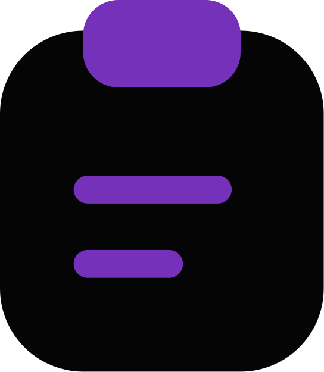
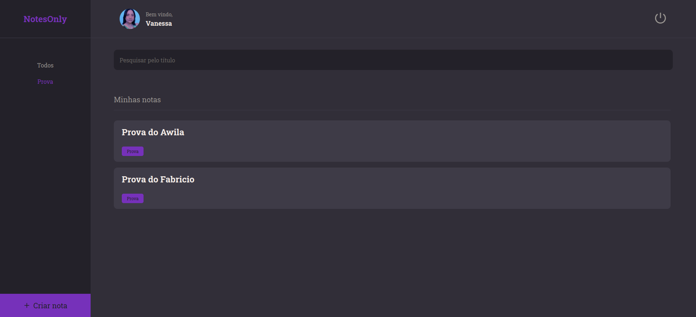
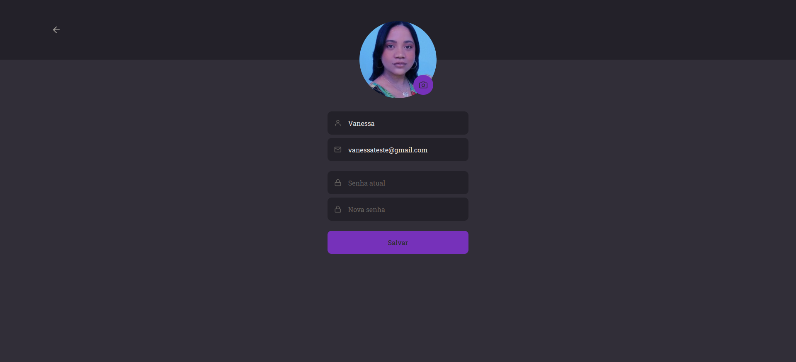
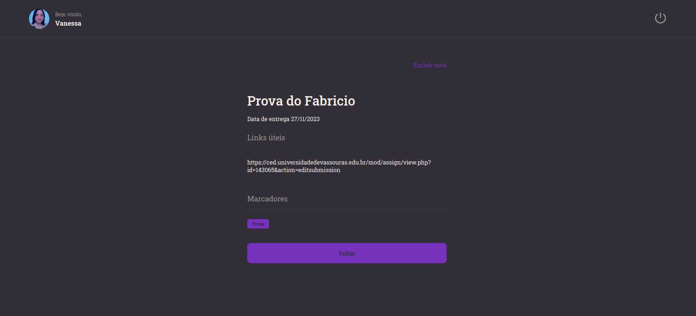
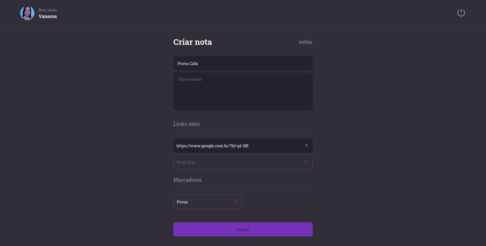

<h1 align="center">
    
    NotesOnly-WEB
</h1>

## 💻 About

O NotesOnly é uma aplicação web na qual os usuários podem se cadastrar e criar de forma organizada anotações sobre determinados assuntos, tendo disponível a adição de titulo, descrição, links e tags para cada nota, além de contar a edição de perfil do usuário, podendo alterar seu avatar, nome, email e senha.

---

## 🎨 Layout
#### SignUp
<p align="center">
  
</p>

#### SignIn
<p align="center">
  
</p>

#### Home
<p align="center">
  
</p>

#### Perfil
<p align="center">
  
</p>

#### Note Preview
<p align="center">
  
</p>

#### Note Create
<p align="center">
  
</p>


<!-- ### Mobile

<p align="center">
  
</p> -->

---

## 🔗 Deploy

Para acessar o deploy do Website da aplicação basta clicar no link a seguir: [Link](https://notesonly.netlify.app/)

> Obs: a aplicação pode demorar um pouco para entrar na primeira execução depois de um tempo, devido ao back-end estar rodando através do plano gratuito na plataforma de hospedagem.

---

## 🚀 How it works

Este projeto contem parte Front-end(React) e Back-end(Node), no entanto, neste repositório só está a parte Front-end Web, para acessar o repositório do Back-end acesse o seguinte [link](https://github.com/Vanessa-Oli/NotesOnly-API)
Este projeto é divido em duas partes:
1. Backend (pasta server) 
2. Frontend (pasta web)

💡Tanto o Frontend quanto o Mobile precisam que o Backend esteja sendo executado para funcionar. -->

### Pré-requisitos

Antes de baixar o projeto você vai precisar ter instalado na sua máquina as seguintes ferramentas:

* [Git](https://git-scm.com)
* [NodeJS](https://nodejs.org/en/)
* [Yarn](https://yarnpkg.com/) ou [NPM](https://www.npmjs.com/)

Além disto é bom ter um editor para trabalhar com o código como [VSCode](https://code.visualstudio.com/)
> Obs: e não se esqueça que também precisa rodar/executar o back-end da aplicação para buscar e checar os dados necessários

Precisará também fazer a seguinte configuração para rodar o projeto:
* Baixar e rodar na sua máquina o Back-end da aplicação (que está em outro repositório, como já dito)
* Colocar dentro do arquivo de configuração do `axios` que esta dentro de `src/services/index.ts`, a `baseURL` de onde está sendo executado o Back-end.
* Pode ser que o `baseURL` venha com um link de Back-end preenchido, mas este pode estar fora do ar, por isso baixe e rode o Back-end da aplicação de forma separada na sua máquina para não ter erro.

#### 🧭 Rodando a aplicação web (Frontend)

```bash
# Clone este repositório
$ git clone git@github.com:Vanessa-Oli/NotesOnly-Web.git

# Vá para a pasta da aplicação Front End
$ cd NotesOnly-Web

# Instale as dependências
$ npm install

# Execute a aplicação em modo de desenvolvimento
$ npm run dev

# A aplicação será aberta em uma porta especificada no terminal de execução
```
---
#### 🧭 Rodando a aplicação web (Frontend) Utilzando docker

```bash
# Clone este repositório
$ git clone git@github.com:Vanessa-Oli/NotesOnly-Web.git

# Vá para a pasta da aplicação Front End
$ cd NotesOnly-Web

# Buildar o container
$ docker-compose up -- build

# Execute a aplicação em modo de desenvolvimento
$ docker-compose up

# A aplicação será aberta em uma porta especificada no terminal de execução
```
---
## 🛠 Technologies

As seguintes ferramentas foram usadas na construção do projeto:

#### **Website**  ([Vite](https://vitejs.dev/)  +  [TypeScript](https://www.typescriptlang.org/))

-   **[Styled-Components](https://styled-components.com/)**
-   **[React-Toastify](https://fkhadra.github.io/react-toastify/introduction)**
-   **[React-Query](https://react-query-v3.tanstack.com/)**
-   **[React-Icons](https://react-icons.github.io/react-icons/)**
-   **[React-Loader-Spinner](https://mhnpd.github.io/react-loader-spinner/docs/intro)**
-   **[React-Router-DOM](https://reactrouter.com/en/main/start/tutorial)**

> Para mais detalhes das dependências gerais da aplicação veja o arquivo [package.json](https://github.com/Vanessa-Oli/NotesOnly-Web/blob/main/package.json)
---

## ✍ Author


[](https://www.linkedin.com/in/vanessa-christiano-de-oliveira-036085184/) 

[](mailto:vanessachristiano10@gmail.com)

---
